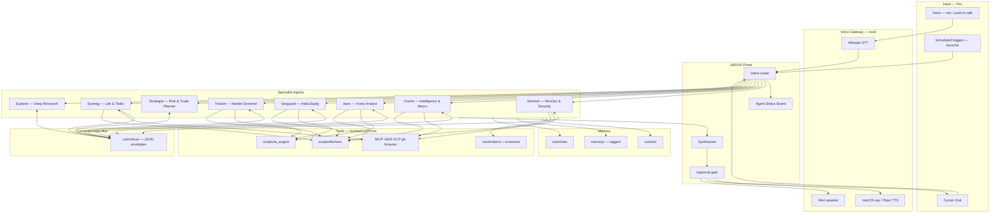
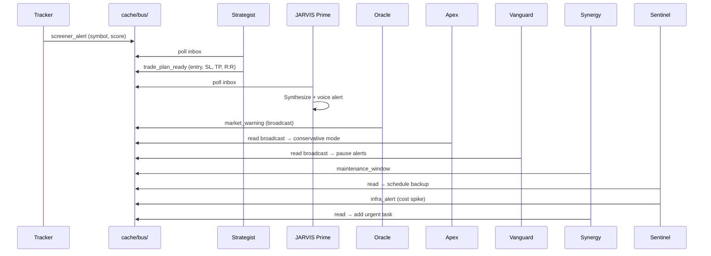

# JARVIS Master Plan — Avengers-Style Personal AI Chief-of-Staff

**Owner:** Jitheesh  
**Created:** 2026-06-13  
**Status:** Draft v0.3 — Voice + Trading + Agent Naming & Communication Bus  
**Goal:** A calm, capable, always-on assistant across daily life, professional work, finance/trading, and world/tech intelligence — **agent-oriented, voice-enabled, token-efficient, secure, and chain-based**.

---

## 1. Vision

JARVIS is not one giant prompt. It is an **orchestrated team of named specialist agents** you talk to — and they talk to you and to each other:

| Layer | Role |
|-------|------|
| **You** | Voice or chat — intent, approval, priorities |
| **Voice Gateway** | Listen → transcribe → route; speak → TTS briefings & alerts |
| **JARVIS Prime** | Router + synthesizer — delegates, merges, reports agent status |
| **Specialist Agents** | Named experts with narrow scopes (see §3.2) |
| **Communication Bus** | Asynchronous JSON envelope exchange (`cache/bus/`) |
| **Tools & Data** | MCP, scripts, TA engines — facts without burning tokens |
| **Memory & Alerts** | Tagged files, cache, proactive opportunity queue |

**Design principles**

1. **Cheap first** — scripts compute indicators; LLM interprets structured summaries only.
2. **Chain, don't dump** — task cards + bus messages; voice speaks condensed output.
3. **Proactive, not noisy** — alerts when setups qualify; silence when nothing meets criteria.
4. **Secure by default** — T0–T3 tiers; you approve every trade and infra change.
5. **Human in the loop** — agents propose plans; you execute.

---

## 2. Agent Roster (quick reference)

| Codename | Role | Domain skill file |
|----------|------|-------------------|
| **Sentinel** | DevOps, infrastructure & security | `domains/sentinel.md` |
| **Oracle** | Global intelligence, macro news & tech briefings | `domains/oracle.md` |
| **Apex** | Forex specialist analyst | `domains/apex.md` |
| **Vanguard** | India equity specialist (day + swing) | `domains/vanguard.md` |
| **Tracker** | High-volume & swing momentum screener | `domains/tracker.md` |
| **Strategist** | Position sizing, risk management & trade planner | `domains/strategist.md` |
| **Synergy** | Chief-of-staff — life planning, calendar & tasks | `domains/synergy.md` |
| **Explorer** | Deep-dive research & browser analysis | `domains/explorer.md` |

**JARVIS Prime** is the orchestrator — not a specialist. It routes, synthesizes, and speaks.

---

## 3. Target architecture



### 3.1 JARVIS Prime (orchestrator)

| Step | What happens | Token cost |
|------|----------------|------------|
| 1. Classify | Voice text or chat → agent + urgency | Low — rules first |
| 2. Bus poll | Check `cache/bus/` for unread messages to/from target agent | Zero |
| 3. Status pull | Read `cache/agent-status.json` | Zero |
| 4. Load context | Tagged grep from `memory/`, one domain skill | Minimal |
| 5. Delegate | Task card to one specialist (parallel only for explicit multi-domain) | Isolated |
| 6. Synthesize | Merge specialist + bus context into JARVIS voice | Medium |
| 7. Speak / persist | TTS for voice; update memory; mark bus messages `read` | Script |

**Invocation examples**

| You say | Routed to |
|---------|-----------|
| *"JARVIS, status"* | Prime → reads status board + Synergy priorities |
| *"JARVIS, what's happening in the world?"* | Oracle |
| *"JARVIS, any forex setups?"* | Apex (+ bus check for Oracle warnings) |
| *"JARVIS, scan momentum stocks"* | Tracker → Strategist (via bus) |
| *"JARVIS, brief my agents"* | Prime → reads all agent statuses |
| *"JARVIS, plan this trade"* | Strategist |
| *"JARVIS, check AWS spend"* | Sentinel |
| *"JARVIS, deep dive on [topic]"* | Explorer |

### 3.2 Specialist agents (meaningful names)

| Agent | Meaningful role | Primary tools | Model tier |
|-------|-----------------|---------------|------------|
| **Sentinel** | DevOps & infrastructure guard — AWS/GCP, K8s, deployments, cloud cost, security alerts | MCP AWS/GCP, CLI, `runbooks/` | Medium |
| **Oracle** | Intelligence & macro watcher — world news, market sentiment, IT/AI/cloud releases | RSS, news scripts, `cache/briefings/` | Small |
| **Apex** | Forex specialist — multi-TF TA on currency pairs during session overlaps | `ta_engine.py`, OHLCV fetchers | Medium |
| **Vanguard** | India equity analyst — NSE/BSE day-trade and swing candidates | `ta_engine.py`, NSE scripts | Medium |
| **Tracker** | Market screener — ranks penny/momentum assets via local scripts | `screener_*.py`, `cache/screeners/` | Small |
| **Strategist** | Trading & risk planner — position size, R:R, entry, stops, partial TPs | `config/trading.yaml`, bus input | Medium |
| **Synergy** | Chief-of-staff — tasks, weekly calendar, habits, daily priorities | `context/`, `memory/tasks.md` | Small–medium |
| **Explorer** | Deep-dive research — browser analysis, doc fetching, complex synthesis | Browser MCP, search | Large — opt-in |

### 3.3 Agent status board

**File:** `cache/agent-status.json` (updated by `scripts/update_agent_status.py` after every agent run)

```json
{
  "updated_at": "2026-06-13T08:00:00+05:30",
  "agents": {
    "Oracle":     { "state": "idle",    "last_run": "2026-06-13T07:00:00", "summary": "Morning brief ready",              "next_run": "12:00" },
    "Apex":       { "state": "alert",   "last_run": "2026-06-13T07:45:00", "summary": "EURUSD setup A- — pending review", "next_run": "08:15" },
    "Vanguard":   { "state": "running", "last_run": "2026-06-13T07:55:00", "summary": "Pre-market scan in progress",      "next_run": "08:45" },
    "Tracker":    { "state": "idle",    "last_run": "2026-06-13T06:00:00", "summary": "3 momentum candidates flagged",    "next_run": "15:45" },
    "Sentinel":   { "state": "idle",    "last_run": "2026-06-12T18:00:00", "summary": "Infra cost within budget",         "next_run": null },
    "Synergy":    { "state": "idle",    "last_run": "2026-06-13T07:00:00", "summary": "2 overdue tasks",                  "next_run": "Sunday 18:00" },
    "Strategist": { "state": "idle",    "last_run": "2026-06-13T07:46:00", "summary": "Trade plan ready for EURUSD",      "next_run": null },
    "Explorer":   { "state": "idle",    "last_run": null,                   "summary": "On demand",                        "next_run": null }
  }
}
```

**Voice output example:**

> "Good morning, Jitheesh. Oracle brief is ready. Apex flagged EUR/USD — pullback to support, 2.1 R:R. Vanguard scan starts at nine. Tracker has three momentum names for Strategist. Synergy shows two overdue tasks. Shall I elaborate on any agent?"

---

## 4. Inter-agent communication bus

Agents cooperate **without** sharing chat history. They exchange structured JSON envelopes in `cache/bus/`.

### 4.1 Directory structure

```
cache/bus/
├── inbox/                  # New messages (unread)
│   ├── {message_id}.json
│   └── ...
├── processed/              # Read/handled messages (archived)
│   └── {message_id}.json
└── broadcast/              # One-to-many (e.g. Oracle warnings)
    └── {message_id}.json
```

### 4.2 Message envelope format

```json
{
  "message_id": "msg-uuid-12345",
  "timestamp": "2026-06-13T08:05:00+05:30",
  "from": "Tracker",
  "to": "Strategist",
  "topic": "screener_alert",
  "priority": "normal",
  "ttl_hours": 4,
  "payload": {
    "symbol": "TATASTEEL",
    "asset_class": "india_equity",
    "trigger_price": 167.40,
    "setup_score": 88,
    "screener_type": "swing_momentum",
    "indicators": { "rsi_14": 64, "ema_cross": "bullish", "volume_ratio": 2.1 }
  },
  "status": "unread"
}
```

**Standard topics**

| Topic | From → To | Purpose |
|-------|-----------|---------|
| `screener_alert` | Tracker → Strategist | Ranked candidate needs risk plan |
| `trade_plan_ready` | Strategist → Prime | Completed plan for delivery |
| `market_warning` | Oracle → broadcast | High-impact macro event — all traders pause |
| `forex_setup` | Apex → Strategist | FX candidate needs sizing |
| `equity_setup` | Vanguard → Strategist | India equity candidate needs sizing |
| `maintenance_window` | Synergy → Sentinel | Scheduled downtime / backup window |
| `infra_alert` | Sentinel → Synergy | Cost spike, disk failure → urgent task |
| `research_request` | Any → Explorer | Deep-dive delegated with narrow brief |
| `research_result` | Explorer → Prime | Structured findings |

### 4.3 Primary communication flows



**Flow 1 — Trade signal pipeline**

1. **Tracker** screens assets → writes `screener_alert` to bus.
2. **Strategist** polls inbox → applies `config/trading.yaml` → writes `trade_plan_ready`.
3. **JARVIS Prime** picks up plan → voice/TTS alert → you review.

**Flow 2 — Volatile news safety lock**

1. **Oracle** detects high-impact event (Fed, RBI, NFP) → writes `market_warning` to `broadcast/`.
2. **Apex** and **Vanguard** read broadcast before scanning → pause or downgrade to conservative mode.
3. **Strategist** rejects new plans until warning TTL expires.

**Flow 3 — Operations & maintenance**

1. **Synergy** flags maintenance task → `maintenance_window` → **Sentinel**.
2. **Sentinel** schedules backup / pauses instances → confirms via bus.
3. **Sentinel** detects AWS cost spike → `infra_alert` → **Synergy** adds urgent priority.

### 4.4 Bus operations (scripts)

| Script | Purpose |
|--------|---------|
| `scripts/bus_write.py` | Write envelope to `inbox/` or `broadcast/` |
| `scripts/bus_poll.py` | Poll unread for agent; respect TTL; archive to `processed/` |
| `scripts/bus_cleanup.py` | Purge expired messages; run via launchd daily |

**Rules**

- Agents **never** pass raw chat logs — only envelopes.
- TTL default: 4h for alerts, 24h for warnings, 7d for research.
- Duplicate suppression: same `symbol + topic` within 4h → skip.
- Max inbox depth: 50 messages — oldest archived first.

---

## 5. Chain pattern & task cards

### 5.1 Task card (handoff to specialist)

```yaml
task_id: uuid
agent: Sentinel | Oracle | Apex | Vanguard | Tracker | Strategist | Synergy | Explorer
intent: one-line goal
constraints: [read-only, no-orders, alert-only]
context_refs: [memory/notes.md#tag/trading-rules]
bus_check: true                    # poll bus before run
tools_allowed: [script:ta_engine, script:nse_fetch]
output_format: trade_plan | screener_result | brief | status | runbook
voice_output: true | false
max_speak_seconds: 90
```

### 5.2 Specialist return

```yaml
status: done | blocked | needs_approval
agent: Apex
summary: 3-5 bullets
artifacts: [cache/alerts/2026-06-13-eurusd.json]
bus_messages_written: [msg-uuid-12345]
approval_required: true | false
next_actions: []
```

### 5.3 Cost policy (ultra_low default)

```yaml
cost_policy:
  mode: ultra_low
  voice: local_whisper_and_say
  morning_brief: cache_first
  chart_analysis: script_first
  screener: script_ranks_top_5
  bus_polling: script_only          # zero LLM cost
  research: on_demand_only
  max_subagents_per_request: 1
  max_spoken_trade_alerts_per_session: 3
  paid_apis: disabled
```

### 5.4 Security model

| Tier | Actions | Gate |
|------|---------|------|
| **T0 Read** | Fetch prices, news, charts, agent status, bus poll | Auto |
| **T1 Draft** | Trade plans, journals, screeners, briefs, bus write | Auto |
| **T2 Mutate** | Cloud/infra changes (Sentinel) | Explicit **"go ahead"** |
| **T3 Financial** | Broker orders, fund transfers | **Never automated** |

**Audit:** `logs/agent-actions.jsonl` — timestamp, agent, action, bus_message_id, approved_by.

---

## 6. Voice layer (local-first, low cost)

### 6.1 Stack

| Component | Phase 1 (free) | Phase 2 (better) |
|-----------|----------------|------------------|
| **STT** | Local Whisper (`faster-whisper`) | Same |
| **TTS** | macOS `say` | Piper TTS (offline) |
| **Activation** | Push-to-talk (`voice/listen.sh`) | Wake word `"JARVIS"` (Phase 4) |
| **Alerts** | `say` + macOS notification | Spoken + `cache/alerts/` |

### 6.2 Proactive voice alerts

| Alert type | Trigger agent | Schedule (IST) |
|------------|---------------|----------------|
| Morning brief | Oracle + Synergy | 07:00 |
| Forex setup | Apex → Strategist | Every 30 min (active sessions) |
| India pre-market | Vanguard | 08:45 |
| Swing / penny scan | Tracker → Strategist | 15:45 |
| Task overdue | Synergy | Daily 07:00 |
| Infra alert | Sentinel → Synergy | On event |
| Agent failure | Prime | On script error |

**Anti-spam:** Max 3 spoken trade alerts per session; bus deduplication within 4h.

---

## 7. Trading & investment (frameworks — not financial advice)

> Agents **analyze, plan, and alert**. They **never** place orders (T3). You review and execute.

### 7.1 Shared pipeline (bus-integrated)

```
Watchlist → Fetch OHLCV (script) → Compute indicators (script)
    → Score (script) → If score ≥ threshold:
        Apex/Vanguard/Tracker → bus → Strategist → trade_plan_ready → Prime → Voice
```

**Indicators (local, no LLM):** RSI, MACD, EMA/SMA, ATR, S/R levels, volume profile, trend structure.

### 7.2 Apex — Forex

| Capability | Detail |
|------------|--------|
| Pairs | Configurable watchlist (majors + minors) |
| Sessions | London / NY / Asia — IST adjusted |
| Analysis | H4 trend → H1 entry → M15 trigger |
| Bus output | `forex_setup` → Strategist |
| Oracle gate | Reads `market_warning` before alerting |

### 7.3 Vanguard — India equity

| Mode | Timing | Focus |
|------|--------|-------|
| Day trading | 08:45 + 11:30 | Nifty context, high-volume movers, ORB |
| Swing | 15:45 EOD | 3–10 day holds, breakout-retest |

**Bus output:** `equity_setup` → Strategist

### 7.4 Tracker — Screeners

| Pipeline | Filters (configurable) |
|----------|------------------------|
| Penny momentum | ₹5–50, vol > 500K, day change > 3%, RSI 50–75 |
| Swing momentum | Price > ₹50, top 20d return decile, above 50/200 EMA, R:R ≥ 2:1 |

Script ranks all → top 5 to bus as `screener_alert` → Strategist plans top 3.

### 7.5 Strategist — Risk & profit-taking

From `config/trading.yaml`:

```yaml
profit_taking:
  tp1: { percent_of_position: 50, at_rr: 1.0 }
  tp2: { percent_of_position: 30, at_rr: 2.0 }
  runner: { percent_of_position: 20, trail: atr_multiplier_2 }
  move_sl_to_be: at_rr_1.0
  max_hold_swing_days: 10
  no_trade_if: [market_warning_active, spread_above_threshold, daily_loss_limit_hit]
```

### 7.6 Synergy — Personal & professional planning

| Area | Capability |
|------|------------|
| Personal | Budget buckets, savings goals, habit tracking |
| Professional | Project priorities, skill investment, income planning |
| Portfolio | Position logging, allocation drift alerts (suggestions only) |

---

## 8. Oracle — Intelligence & world briefings

| Feed | Output |
|------|--------|
| Global macro | Rates, FX, geopolitics — 5 bullets |
| US + India markets | Futures, VIX, India VIX, FII/DII |
| IT / AI / cloud | Releases, pricing, model launches |
| Personal relevance | Cross-ref watchlists + `context/active-projects.md` |
| Bus output | `market_warning` on high-impact events |

---

## 9. Repository layout

```
JARVIS/
├── config/
│   ├── profile.yaml.example
│   ├── preferences.yaml.example
│   ├── infra.yaml.example
│   └── trading.yaml.example
├── context/
│   ├── active-projects.md
│   ├── priorities-weekly.md
│   └── jarvis-master-plan.md
├── memory/
│   ├── notes.md                  # #tag/trading #tag/devops #tag/personal
│   ├── tasks.md
│   ├── trading-journal/
│   └── rollups/
├── cache/
│   ├── bus/
│   │   ├── inbox/
│   │   ├── processed/
│   │   └── broadcast/
│   ├── agent-status.json
│   ├── briefings/
│   ├── market-snapshots/
│   ├── alerts/
│   └── screeners/
├── scripts/
│   ├── ta_engine.py
│   ├── fetch_forex_ohlcv.py
│   ├── fetch_nse_data.py
│   ├── screener_penny.py
│   ├── screener_swing.py
│   ├── fetch_news_digest.py
│   ├── morning_brief.sh
│   ├── update_agent_status.py
│   ├── bus_write.py
│   ├── bus_poll.py
│   └── bus_cleanup.py
├── voice/
│   ├── listen.sh
│   ├── speak.sh
│   ├── alert.sh
│   └── launchd/                  # com.jarvis.*.plist files
├── logs/
│   └── agent-actions.jsonl
└── .cursor/skills/jarvis/
    ├── SKILL.md                  # JARVIS Prime orchestrator
    └── domains/
        ├── sentinel.md           # was devops.md
        ├── oracle.md             # was intel.md
        ├── apex.md               # was forex.md
        ├── vanguard.md           # was india-equity.md
        ├── tracker.md            # was screener.md
        ├── strategist.md         # new
        ├── synergy.md            # was planning.md
        ├── explorer.md           # was research.md
        └── trading.md            # gateway — links to Apex/Vanguard/Tracker/Strategist
```

### 9.1 Tagged memory schema

```markdown
## 2026-06-13 — Nifty day-trade rule #tag/trading #tag/vanguard #tag/day
- Max 2 trades per day; stop after 1R loss.

## 2026-06-13 — EKS upgrade blocker #tag/devops #tag/sentinel #tag/project/eks
- Waiting on IAM role approval.
```

---

## 10. Phased rollout

### Phase 0 — Foundation (Week 1) ◻️

- [ ] Config examples: `profile`, `preferences`, `trading.yaml`
- [ ] `context/active-projects.md`, `memory/notes.md`, `memory/tasks.md`
- [ ] Domain skills renamed to agent codenames (§9)
- [ ] Initialize `cache/bus/{inbox,processed,broadcast}/`
- [ ] Agent roster table in `SKILL.md`

**Exit:** `JARVIS, status` returns real state with named agents.

---

### Phase 1 — Orchestrator & bus (Week 2) ◻️

- [ ] Task-card router in `SKILL.md` with agent name mapping
- [ ] `bus_write.py`, `bus_poll.py`, `bus_cleanup.py`
- [ ] `update_agent_status.py` — named agent keys
- [ ] Document bus flows in each domain skill
- [ ] Voice-friendly response format

**Exit:** Tracker → bus → Strategist → Prime pipeline works end-to-end (mock data).

---

### Phase 2 — Data & analysis scripts (Week 3–4) ◻️

- [ ] `ta_engine.py`, forex/NSE fetchers, screeners
- [ ] Oracle news digest + `market_warning` bus integration
- [ ] Apex/Vanguard/Tracker write real `screener_alert` / `forex_setup` / `equity_setup`
- [ ] Strategist reads bus → writes `trade_plan_ready`

**Exit:** Live screener produces ranked candidates; Strategist generates plan.

---

### Phase 3 — Voice + proactive alerts (Week 5–6) ◻️

- [ ] `voice/listen.sh`, `speak.sh`, `alert.sh`
- [ ] launchd plists for Oracle, Apex, Vanguard, Tracker schedules
- [ ] Spoken alerts from Prime on `trade_plan_ready`
- [ ] Anti-spam + bus deduplication

**Exit:** Morning voice brief; forex/equity alert when setup scores ≥ threshold.

---

### Phase 4 — Polish & optional cloud (Week 7+) ◻️

- [ ] Wake word `"JARVIS"`
- [ ] Piper TTS
- [ ] Paid market data API (only if free sources fail)
- [ ] Optional Telegram/Slack mirror (reads same cache/bus — no duplicate LLM)
- [ ] Chart vision analysis (opt-in, higher cost)

---

## 11. Cost estimate

| Component | Monthly marginal cost |
|-----------|----------------------|
| Phases 0–3 local (Cursor + scripts + voice + bus) | **$0–3** |
| Bus polling / status scripts | **$0** |
| Heavy Explorer research / vision charts | **+$2–5** (opt-in) |
| Paid market data API | **+$0–15** (only if needed) |

---

## 12. Prerequisites

| Requirement | Purpose |
|-------------|---------|
| macOS + launchd | Voice, scheduling, bus |
| Python 3.10+ | TA engine, screeners, bus scripts |
| Node.js | MCP servers |
| faster-whisper | Local STT (Phase 3) |
| AWS/GCP/gh CLI | Sentinel |
| Cursor subscription | Prime orchestration |

---

## 13. Decisions — confirmed defaults

| # | Decision | Default |
|---|----------|---------|
| 1 | Timezone | Asia/Kolkata |
| 2 | Markets | US + India + Forex |
| 3 | Agent names | Sentinel, Oracle, Apex, Vanguard, Tracker, Strategist, Synergy, Explorer |
| 4 | Communication | File-based bus at `cache/bus/` |
| 5 | Voice | Local STT/TTS — Phase 3 |
| 6 | Cost mode | ultra_low |
| 7 | Trade execution | Always manual (T3) |

**Still need:** Broker names, forex pairs, NSE watchlist, risk per trade %, max daily loss.

---

## 14. Verification plan

### Consistency checks (manual)

- [ ] All 8 agent names identical in: §2 roster, §3 diagram, §3.2 table, §3.3 status JSON, §4 topics, §9 layout, §10 phases
- [ ] No orphaned old names (`DevOps Agent`, `Forex Analyst Agent`, `intel.md`, etc.)
- [ ] Bus flows match specialist responsibilities
- [ ] Security tiers apply correctly per agent (Sentinel=T2, Strategist/Apex/Vanguard=T1 only)

### Functional checks (Phase 1+)

- [ ] `bus_write.py` → `bus_poll.py` round-trip < 500ms
- [ ] Oracle `market_warning` blocks Apex/Vanguard alerts
- [ ] Tracker `screener_alert` → Strategist `trade_plan_ready` → Prime voice
- [ ] Sentinel `infra_alert` → Synergy task created
- [ ] `agent-status.json` updates on every agent run
- [ ] Expired bus messages archived by `bus_cleanup.py`

---

## 15. Success metrics

| Metric | Target |
|--------|--------|
| Bus message latency | < 500ms (local file I/O) |
| Voice brief latency | < 15s (cached) |
| False alert rate | < 2/day |
| Token cost per trade scan | < 5K tokens |
| Agent name consistency | 100% across docs/code |
| Safety | Zero unapproved T2; zero T3 automation |

---

## 16. Immediate next steps

1. **Confirm** this v0.3 naming + bus design.
2. **Phase 0** — scaffold configs, memory, renamed domain skills, `cache/bus/` dirs.
3. **Phase 1** — bus scripts + agent status board.
4. Provide broker, watchlists, risk rules for `trading.yaml`.

Say **"go Phase 0"** to start scaffolding.

---

## 17. Revision log

| Date | Version | Changes |
|------|---------|---------|
| 2026-06-13 | v0.1 | Initial master plan |
| 2026-06-13 | v0.2 | Voice, trading agents, screeners, proactive alerts |
| 2026-06-13 | v0.3 | Named agents (Sentinel–Explorer), inter-agent bus protocol, full doc restore + consistency pass |

---

*JARVIS agents provide analysis frameworks, plans, and alerts — not financial advice. All trades are your decision.*
